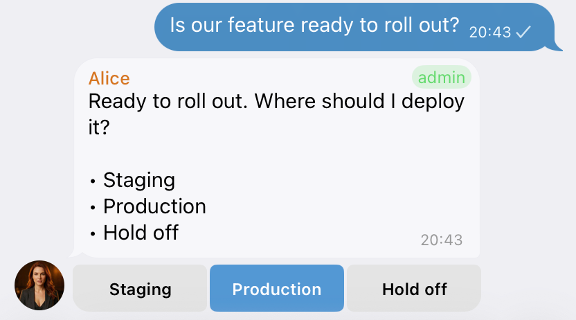
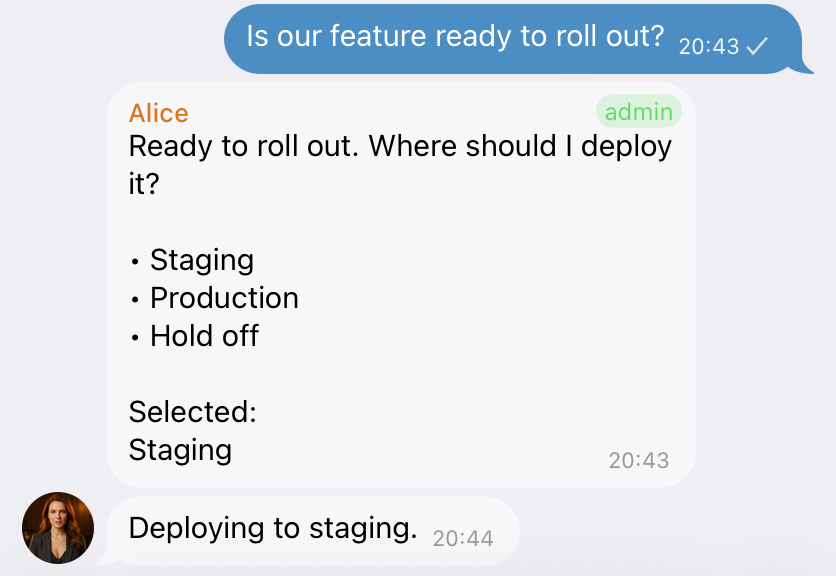

# OpenClaw Quick Replies

[](https://github.com/goldmar/openclaw-quick-replies/actions/workflows/ci.yml)
[](https://www.npmjs.com/package/openclaw-quick-replies)
[](LICENSE)

**Turn repetitive Telegram choices into one-tap answers.**

OpenClaw Quick Replies adds useful reply buttons when your assistant asks a clear question, requests an answer, or presents a short list of choices. Instead of typing “Approve,” “Staging,” or “Hold off,” you can tap once and keep moving.

There is no need to build buttons into every workflow. OpenClaw Quick Replies works across your OpenClaw Telegram conversations, stays out of the way when a message does not need a choice, and removes the buttons after you select an answer so the chat remains easy to follow.

## Where it works

| Channel | Support | What to expect |
| --- | --- | --- |
| Telegram | **Supported** | Suggested replies appear as buttons. A tap is sent back to your assistant in the context of the original question. |
| Discord | Not yet supported | OpenClaw can display and acknowledge Discord interactions, but does not yet provide plugins a supported way to send a generic selected reply back to the agent. |
| Other channels | Not supported | OpenClaw Quick Replies does not add buttons or handle selections on these channels. |

Discord support can be added when OpenClaw exposes a generic inbound reply-submission contract like Telegram's `submitText` path. `openclaw-code-agent` can offer Discord buttons today because each button performs a specific action owned by that plugin; that stateful design cannot safely stand in for arbitrary quick-reply text.

### Suggested replies



### After selection



## Why use OpenClaw Quick Replies?

- **Make decisions faster.** Answer approvals, yes/no questions, and short choices with one tap.
- **Use it across workflows.** You do not have to hand-code buttons for every prompt or automation.
- **Keep chats clean.** The selected answer is recorded on the original message and the old buttons are removed.
- **Avoid button overload.** Status updates, completion messages, open-ended questions, media, and messages that already have controls stay unchanged.
- **Keep control with the user.** A quick reply is ordinary reply text. It never bypasses or replaces OpenClaw's approval and permission controls.
- **Fail gracefully.** If suggestions are slow, uncertain, incomplete, or unavailable, the original message is delivered normally without buttons.
- **Stay current safely.** A lightweight daily check can offer an update button, but installation and Gateway restart remain separate, explicit choices.

## What the experience looks like

Suppose OpenClaw asks:

> Where should I deploy this: staging, production, or should I hold off?

OpenClaw Quick Replies can add:

```text
[ Staging ]  [ Production ]  [ Hold off ]
```

Tap **Staging**, and OpenClaw receives that answer tied to the question you selected it from. You get the same result as typing the answer yourself, with less friction and less risk of a short response being misunderstood later in the conversation.

Buttons are considered only when the assistant is clearly asking for an answer. Normal conversation and informational messages remain normal text.

## Install

You need OpenClaw 2026.7.1 or newer. Most users should install from ClawHub:

```bash
openclaw plugins install clawhub:openclaw-quick-replies
openclaw plugins enable openclaw-quick-replies
```

You can also install the same release from npm:

```bash
openclaw plugins install npm:openclaw-quick-replies
openclaw plugins enable openclaw-quick-replies
```

OpenClaw normally reloads a managed Gateway after installation. If buttons do not appear, restart it and check that the plugin loaded:

```bash
openclaw gateway restart
openclaw plugins inspect openclaw-quick-replies --runtime --json
```

That is all most installations need. The default settings are designed to work without configuration.

## How it decides when to show buttons

For each eligible Telegram message, OpenClaw Quick Replies asks a small, tool-disabled evaluator to determine whether the message calls for a concise set of answers. It then checks that the suggestions are complete, short, and confident enough to display.

OpenClaw Quick Replies leaves the message unchanged when:

- it is not an explicit question, answer request, or numbered/bulleted choice;
- it is an update, error, reasoning trace, fallback notice, or media message;
- it already has interactive controls;
- the evaluator omits a listed option or returns a low-confidence result; or
- evaluation takes longer than the configured time limit.

The original message is never held indefinitely. The default evaluation budget is 20 seconds; after that, the message continues without buttons.

## Optional configuration

No configuration is required. To change the defaults, add settings under `plugins.entries.openclaw-quick-replies.config`. For example:

```json
{
  "plugins": {
    "entries": {
      "openclaw-quick-replies": {
        "enabled": true,
        "config": {
          "maxSuggestions": 8,
          "minConfidence": 0.6
        }
      }
    }
  }
}
```

| Setting | Default | What it changes |
| --- | ---: | --- |
| `enabled` | `true` | Turns OpenClaw Quick Replies on or off. |
| `maxSuggestions` | `6` | Maximum number of buttons shown for one message (1–10). |
| `minConfidence` | `0.7` | How certain the evaluator must be before buttons appear (0–1). |
| `model` | OpenClaw default | Optional evaluator model in `provider/model` format. |
| `thinkLevel` | `minimal` | Embedded evaluator thinking level: `off`, `minimal`, `low`, `medium`, `high`, `xhigh`, `adaptive`, `max`, or `ultra`. |
| `maxInputChars` | `1200` | Longest message the plugin will evaluate (1–12000). |
| `maxLabelChars` | `24` | Longest visible button label (1–64). |
| `maxValueBytes` | `42` | Maximum submitted answer size (1–42 UTF-8 bytes). |
| `evaluationTimeoutMs` | `20000` | How long to wait before sending the original message without buttons (100–30000 ms). |
| `updateChecks` | `true` | Checks npm once per day for a newer stable version and offers an update button on a suitable Telegram message. |

If you choose a specific `model`, OpenClaw requires you to allow that exact model for this plugin:

```json
{
  "plugins": {
    "entries": {
      "openclaw-quick-replies": {
        "config": { "model": "provider/model" },
        "llm": {
          "allowModelOverride": true,
          "allowedModels": ["provider/model"]
        }
      }
    }
  }
}
```

Use `openclaw models list` to find a model available to your installation. A small, fast model is usually the best fit because this task is limited to deciding whether a message needs buttons and proposing short answers. On OpenClaw 2026.7.1, local representative testing found subscription-backed Luna and Codex Spark effectively tied and GPT-5.4 Mini slower; all returned valid complete choice sets. Keep Luna when it is available rather than assuming a smaller model will reduce end-to-end latency.

`thinkLevel` maps directly to OpenClaw's embedded-run thinking control. OpenClaw Quick Replies defaults it to `minimal`, the lowest nonzero level, to keep this bounded evaluator responsive while retaining a small reasoning budget. Before this setting was added, an omitted value inherited the host/model default; existing configurations remain valid, but can set a different listed value explicitly if they need the previous effective behavior. OpenClaw models can support different subsets of the listed levels, so OpenClaw Quick Replies checks the selected model's runtime thinking policy and sends the message without buttons rather than silently substituting another level when the configured value is unsupported. This is separate from reasoning visibility, which remains disabled for the evaluator.

## Model usage, cost, and privacy

Each eligible message can make one additional model request. The cost and latency depend on the model provider configured in OpenClaw. Identical requests happening at the same time share one evaluation, and validated eligible or ineligible decisions are cached briefly to avoid unnecessary repeat calls. Failures and timeouts are not cached.

Numbered and bulleted choices are still evaluated by the model. OpenClaw Quick Replies does not use a deterministic list parser or other non-model path to decide eligibility or generate answers.

The evaluator receives the outgoing message text and the Telegram channel name. It runs in an isolated temporary raw-model session with tools and message delivery disabled. OpenClaw user MCP servers are removed from the per-run config without changing shared configuration. OpenClaw 2026.7.1 can still inherit MCP servers from Codex's own user configuration; see [the architecture note](docs/ARCHITECTURE.md#openclaw-202671-codex-mcp-limitation). If an outgoing message must not be sent to your configured model provider, do not use OpenClaw Quick Replies for that conversation.

OpenClaw Quick Replies does not send button values to its own remote service. It keeps recent source-message identifiers in process memory for five minutes to prevent a repeated tap from submitting the same answer twice.

When `updateChecks` is enabled, the plugin requests public package metadata from the npm registry at most once per day. It sends no conversation content, user identifier, or configuration with that request. Disable `updateChecks` if you prefer to manage updates entirely yourself.

## Safe selections

OpenClaw Quick Replies accepts only authorized Telegram callbacks that still contain the original message context. Malformed, oversized, altered, repeated, or context-free selections are ignored rather than being submitted as detached instructions.

After a valid tap, the plugin:

1. removes the old buttons;
2. records the selected answer on the original message; and
3. sends the answer to OpenClaw with the source question attached as context.

See [SECURITY.md](SECURITY.md) for the full security boundary and reporting instructions.

## Troubleshooting

- **No buttons appear:** Confirm the destination is Telegram and the assistant is explicitly asking for an answer. Informational or open-ended messages intentionally stay as text.
- **The plugin is not listed:** Run `openclaw plugins inspect openclaw-quick-replies --runtime --json`, then restart the Gateway if needed.
- **A model override is rejected:** Add the exact `provider/model` value to this plugin's `llm.allowedModels` list.
- **Messages feel slower:** Inspect `evaluation_started`, `evaluation_cache_hit`, `evaluator_completed`, `evaluator_cleanup`, and `decorated`/`suppressed` diagnostics. Their bounded millisecond fields separate plugin work from the embedded model run; Telegram transport begins afterward. Lowering `evaluationTimeoutMs` limits delay and cancels the run, while a timeout still delivers the original message.
- **One of the listed choices is missing:** OpenClaw Quick Replies suppresses the entire button set when the evaluator does not return every option.
- **A button tap does nothing:** Stale, repeated, unauthorized, or altered callbacks are deliberately ignored.

## Updates and compatibility

OpenClaw Quick Replies requires OpenClaw 2026.7.1 or newer and Node.js 22.22.3 or newer. Update it through OpenClaw:

```bash
openclaw plugins update openclaw-quick-replies
```

OpenClaw does not schedule this command by itself. Run it when you want to check manually, or schedule `openclaw plugins update --all` centrally for all of your plugins.

OpenClaw Quick Replies can also check npm once per day in the background. When a newer stable version exists, it adds an update control to a suitable Telegram message that does not already have buttons. The control delegates installation to OpenClaw's native plugin manager with the exact version you approved, preserving the managed npm or ClawHub source through an exact-version force reinstall. It then verifies the installed version before offering a separate Gateway restart confirmation. Set `updateChecks` to `false` to disable these notices.

## Development

```bash
corepack enable
pnpm install --frozen-lockfile
pnpm verify
pnpm proof:quick-replies:all
pnpm release:check
```

See the [contributor guide](.github/CONTRIBUTING.md), [development guide](docs/DEVELOPMENT.md), [technical reference](docs/REFERENCE.md), and [changelog](CHANGELOG.md).

## License

MIT. See [LICENSE](LICENSE).
